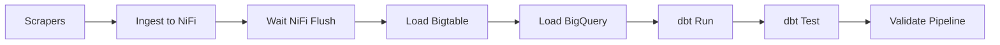

# Price Intelligence Platform — Maroc

## Description
Pipeline de données end-to-end pour la collecte, le stockage, la transformation et la validation des prix e-commerce au Maroc. 

Cette version inclut un pipeline hybride **Streaming (NiFi)** et **Batch (Airflow)** avec détection automatique des variations de prix et stockage historique dans **Google Bigtable**.

- **Sources :** Jumia.ma | Avito.ma | Amazon.ma | Connecto.ma | Electroplanet.ma
- **Projet GCP :** project-32a82952-90fa-4dd7-b9c
- **Stack :** Scrapy, NiFi, Airflow, Bigtable, BigQuery, dbt, Streamlit

---

## Architecture du Pipeline

    [Scrapers (Jumia, Avito, Amazon, Connecto)]
                        |
            ┌───────────┴───────────┐
            ▼                       ▼
    [Real-time Streaming]     [Batch Processing]
      (HTTP POST to NiFi)      (JSON files in data/raw/)
            |                       |
      [Apache NiFi]           [Apache Airflow]
     ListenHTTP (8888)        DAG Pipeline
     JoltTransform            Wait NiFi Flush
     WriteToBigtable          Load Bigtable (Full)
            |                       |
            └───────────┬───────────┘
                        ▼
                [Google Bigtable]
             Instance: price-intelligence
             Table: prices (price_cf, metadata_cf, agg_cf)
             *Détection de changement de prix*
                        |
                 [Google BigQuery]
              Dataset: price_intelligence_dbt
                        |
                  [dbt Cloud/CLI]
             Transformation & Qualité (ADC OAuth)
                        |
              [Streamlit Dashboard]
               Live Market Insights

---

## Stack Technique

| Couche          | Technologie               | Détails |
|-----------------|---------------------------|---------|
| Scraping        | Scrapy                    | Spiders multi-sources, rotation UA |
| Streaming       | Apache NiFi 1.23.2        | Ingestion temps réel via HTTP 8888 |
| Orchestration   | Apache Airflow 2.8.1      | DAG robuste avec retries & timeouts |
| Stockage NoSQL  | Google Bigtable           | Time-series (product_id#timestamp) |
| Transformation  | dbt-bigquery 1.7.0        | Modèles staging/cleaned/aggregated |
| Analytique      | Google BigQuery           | Entrepôt de données centralisé |
| Authentification| GCP ADC (OAuth)           | Profils dbt sécurisés sans tokens hardcodés |
| Dashboard       | Streamlit + Plotly        | Visualisation des tendances de prix |
| Infrastructure  | Docker Compose            | Déploiement multi-container |

---

## Airflow DAG Flow



- **Load Bigtable :** Script Python optimisé gérant l'encodage UTF-8 et comparant le prix actuel au prix précédent stocké pour générer des alertes de variation.
- **Ingestion NiFi :** Intégrée au DAG après chaque scraper pour une mise à jour immédiate de l'index Bigtable.

---

## Démarrage et Utilisation

### 1. Lancer l'infrastructure
```bash
docker compose up -d
```

### 2. Configuration d'authentification
Le projet utilise des **Application Default Credentials (ADC)**. Assurez-vous que le fichier `gcp-credentials-new.json` est présent à la racine.
*Le profil dbt utilise désormais la méthode `oauth` pour une gestion permanente des jetons.*

### 3. Exécuter le pipeline
*   **Airflow :** Accédez à `http://localhost:8080` (admin/admin) et activez `price_intelligence_pipeline`.
*   **NiFi :** Visualisez le flux à `http://localhost:9090/nifi` (admin/admin12345678).

### 4. Visualisation
```bash
# Dashboard Streamlit
set GOOGLE_APPLICATION_CREDENTIALS=gcp-credentials-new.json
python -m streamlit run dashboard/dashboard.py
```

---

## Bigtable Schema

- **price_cf :** `price`, `currency`, `source`, `category`
- **metadata_cf :** `product_name`, `url`, `scraped_at`
- **agg_cf :** `prev_price`, `price_changed` (alertes), `is_discounted`

---

## dbt Models & Tests

- **prices_cleaned :** Déduplication et filtrage des prix invalides.
- **prices_aggregated :** Calcul des moyennes par catégorie et plateforme.
- **Tests :** Unicité, non-nullité et intégrité référentielle validés à chaque run.